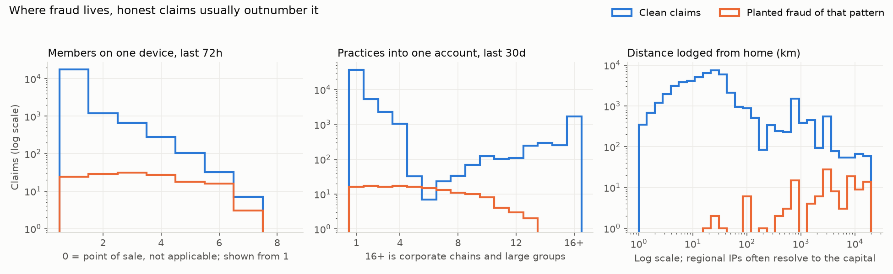
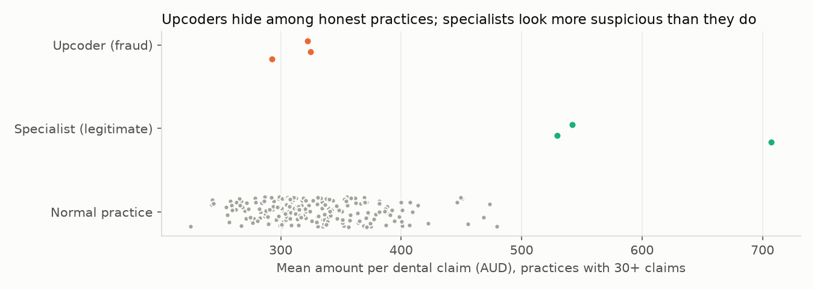

# Stage 0: the data generator

Every number below comes from `output.txt`, which `check-dataset.py` writes. To reproduce it:

```bash
python src/generate.py
python stages/00-data-generator/check-dataset.py
```

## What the concept is

A synthetic dataset is a story you tell in code about how claims happen. You decide how many members there are, how often they claim, which devices and bank accounts they use and where they are when they lodge. Then you plant fraud inside that story and record which claims you planted, which gives you a label for every claim.

The fraud is the easy part. The honest behaviour is what makes the dataset worth anything. A model learns to separate fraud from what surrounds it, so it can only be as good as the honest background is realistic. If every honest member lodges from their own phone at home and gets paid into their own account, any "shared device" or "shared account" signal separates fraud perfectly. Every model then looks brilliant, and none of it transfers to real claims.

## Why it matters in fraud specifically

Fraud detection is almost entirely about false positives. With 1% of claims fraudulent, honest claims outnumber fraud 99 to 1, so a small quirk that affects only a few percent of honest claims can still swamp all of the fraud. The rules you run today look for real fraud behaviour, but each one also matches something honest people do all the time:

| Rule | Fraud it targets | Honest behaviour that looks the same |
|---|---|---|
| Many members on one device | Ring operator lodging for mules | Parents lodging for children, a family tablet, a carer lodging for an elderly parent, a practice's reception kiosk |
| Many practices into one account | Ring collecting benefits | Corporate chains and multi-site owners paid into one head-office account, busy families, young adults whose benefits go to a parent's account |
| Lodged far from home | Account takeover, claims while overseas | Holidays, FIFO rosters, moving without updating the address, VPNs, and IP geolocation that puts regional members in the capital city |

## What was built

**The population.** 8,060 memberships holding 18,063 members, spread across 30 Australian cities and towns by population. 659 practices (dental, physio, optical, chiro, podiatry, massage, psychology) with 2,637 practitioners. Each practice has its own price list, so the same practice always charges the same fee for the same item. That becomes useful later.

**The claims.** 49,392 claims submitted between 1 July 2025 and 30 June 2026. 58% are lodged at the practice's point-of-sale terminal, 34% in the app, 5% on the web and 2% on a reception kiosk. Dental is 45% of claims.

Every claim has the fields you asked for: member, practice, practitioner, service date, submission timestamp, amount, item codes, claim type, submission IP with its geolocation, device fingerprint, and payee BSB and account.

**Two sets of files, kept apart on purpose.** `claims.csv`, `members.csv`, `practices.csv` and `practitioners.csv` hold only what a fund would actually see. The ground truth (which claims are fraud, which ring they belong to, and which honest context applies) lives in separate `*_truth.csv` files. No model may ever read the truth files as an input. That separation is the first habit a data scientist will look for.

### The planted fraud

540 fraudulent claims, 1.09% of the total.

| Pattern | Claims | How it was planted |
|---|---|---|
| Device ring | 148 | 24 rings. One device lodges for 3 to 7 unrelated members within 4 to 60 hours, favouring high-value optical and dental items. |
| Bank ring | 148 | 16 rings. 3 to 6 unrelated members, each on their own phone, claim at a spread of unrelated practices over 10 to 35 days, all paid into one account. |
| Distance | 122 | 40 account takeovers by a pool of 25 fraudsters (overseas, interstate, or routed through a local mobile or VPN) and 25 members lodging claims for home-practice services dated while they were overseas. |
| Upcoding | 122 | 6 practices bill a higher-value item than they delivered on about 30% of eligible claims. Your rules don't look for this. |

The rings overlap, as organised groups do. 99 claims carry both a device-ring and a bank-ring id, because some device rings collect through a shared account. Of the 144 ring members, 63 appear in more than one ring and 60 are synthetic identities: people recruited or invented shortly before the ring ran.

Fraud is lumpy over time. The monthly rate runs from 0.5% (March) to 1.6% (February), because rings arrive in bursts. Keep that in mind whenever someone quotes a single fraud rate.

### The honest confounders

Clean claims carrying each context (a claim can carry more than one):

| Context | Clean claims | What it is |
|---|---|---|
| Shared device | 7,340 | A parent lodging for a child, or anyone lodging on the family tablet or desktop |
| Family batch | 5,784 | The whole family sees the dentist on one afternoon and a parent lodges every claim within a minute or two |
| IP resolves to a hub | 3,717 | Mobile carriers and regional ISPs geolocate to the capital city, or to Sydney or Melbourne |
| Multi-site account | 3,485 | Two to four practices with one owner and one account |
| Corporate account | 2,947 | Chains of 12 to 25 practices paid into one head-office account |
| Reception kiosk | 1,083 | Five busy practices hand patients an iPad to lodge on the spot |
| Treated while travelling | 760 | A physio visit on an interstate trip |
| Carer device | 568 | An adult child lodges for an elderly parent in another membership, sometimes in another city |
| Extended-family account | 450 | A young adult's benefits paid into a parent's account |
| Specialist practice | 448 | 8 practices with unusual but legitimate billing: a periodontist, sports physios, a behavioural optometrist, and so on |
| Travel (domestic or overseas) | 488 | Lodged while away, including 177 from overseas |
| VPN, mover, FIFO | 518 | IP says Singapore; moved interstate without updating the address; on a mine site two weeks in three |

27,152 clean claims (56%) carry no special context at all. The other 44% are honest claims that could, in principle, trip a rule.

## What the numbers showed

To check that the honest cases really are hard, I computed the three signals your event strategies produce and applied a naive threshold to each. This is not Stage 3. It only tests whether the generator did its job.



| Naive rule | Claims flagged | Fraud among them | Share of its own pattern caught | Main honest claims caught |
|---|---|---|---|---|
| 3+ members on one device in 72h | 1,175 | 97 (8.3%) | 95 of 148 (64%) | Kiosk 628, shared device 448, family batch 446 |
| 3+ practices into one account in 30d | 6,463 | 199 (3.1%) | 115 of 148 (78%) | Corporate 2,938, multi-site 2,253 |
| Lodged 500+ km from home | 3,578 | 134 (3.7%) | 109 of 122 (89%) | IP hub 1,342, treated while travelling 588 |
| Any of the three | 10,740 | 345 (3.2%) | 345 of all 540 fraud | |

Four things stand out.

**1. Every rule catches real fraud, and every rule buries it.** Of the 10,740 claims the three rules flag between them, about 97 in 100 are honest. At a review capacity of 200 claims a month (2,400 a year), you couldn't even look at a quarter of them. This is the shape of the whole problem. The rest of this project is about ranking those claims so that the fraud comes first.

**2. The device rule misses a third of the device rings, and for a structural reason.** The window looks backwards from each claim, which is all a real-time rule can do. When the first mule's claim arrives, the device has seen one member. When the second arrives, it has seen two. Only from the third claim onwards does the rule fire, so the first claims of every ring are paid before anything trips. That isn't a tuning problem. It's what real-time detection means, and it's why network-level signals (Phase 3) matter.

**3. The account signal isn't even one-directional.** In the middle chart, at around 5 to 7 practices fraud and honest claims are roughly level, and past 8 the honest corporate tail takes over again. A threshold rule can only say "more is worse". A model can learn that 5 to 7 is the danger zone and 20+ is almost certainly a chain. That's the first hint of where machine learning earns its keep, and Stage 3 will measure it.

**4. The pattern you don't detect is well hidden.** Only 15 of the 122 upcoded claims trip any of the three rules, and those only by coincidence. At practice level it's worse:



The three upcoding dental practices average $293 to $325 per claim, which puts them between the 21st and 53rd percentile of normal practices: squarely in the middle. The three specialist practices average $529 to $707, higher than every normal practice. A simple "unusually expensive practice" rule would investigate the honest specialists and wave the upcoders through. Upcoding hides in the *mix* of items (a periodic exam billed as a comprehensive one), not in the average.

**Smaller observations worth keeping:**

- 13 of the 122 distance frauds don't look far at all, because the fraudster came through an Australian mobile network or VPN that geolocates near the victim.
- 344 claims were lodged from an overseas IP: 60 fraudulent and 284 honest. "Lodged from overseas" is suspicious, but most of those claims are honest.
- Fraud also differs at the level of a single claim. The median fraudulent claim is $292 against $226 for honest ones, and 74% of fraud arrives through the app against 34% of honest claims (13% against 59% at point of sale). Stage 2 measures how far that alone gets you. I planted these differences on purpose, as you'll see below.

## What to take from it

- **Every result in this project is only as honest as these confounders.** Remove the kiosks, chains and family batches and the rules would look close to perfect. When a data scientist shows you a strong result on synthetic data, the first question to ask is: "What does the honest background look like, and who designed it?"
- **Keep observable data and truth in separate places.** Here they are separate files. In a real system, it means knowing which fields exist when the claim arrives and which are filled in afterwards. Stage 5 turns on this.
- **Fraud is rare and lumpy.** A 1% average hides months at 0.5% and months at 1.6%. Small monthly samples swing a lot.
- **The real-time window has a cost.** Backward-looking rules can't see the start of a ring. That's a design fact about event strategies, not a flaw in this particular rule.

## What this dataset cannot teach you (read before Stage 3)

These limits matter more than any number above:

1. **I built the rings from your rule definitions.** A device ring *is* several members on one device in a short window, because that's how I wrote it. Stage 3 will measure the lift from those same features, and some of that lift is circular. We'll come back to this.
2. **The claim-level tells are my assumptions.** Fraud skews to high-value optical and dental items, arrives mostly through the app, and 60% of fake receipts don't match the practice's price list. I chose those because they're plausible, not because I measured them. Real fraud may differ.
3. **The labels are perfect.** Every planted fraud is labelled and every honest claim is clean. Real labels only exist for fraud someone caught (Stage 4).
4. **The fraudsters never adapt.** They behave the same all year (Stage 8 changes that).
5. **The overseas weightings are arbitrary, and sensitive.** I weighted fraudster locations differently from holiday destinations so that country carries a little signal. In real data, IP country is close to a proxy for nationality and ethnicity. A model that leans on it can end up treating members with family overseas as suspects. Know this before anyone suggests "country risk" as a feature.

## Files

- `../../src/generate.py`: the generator. Each fraud pattern and each confounder is a labelled block, so you can read how every one was built.
- `../../src/features.py`: data loading and the three rule signals, shared with later stages.
- `check-dataset.py`: the checks and figures for this stage.
- `output.txt`: the printed results quoted above.
- `figures/`: the two charts.
